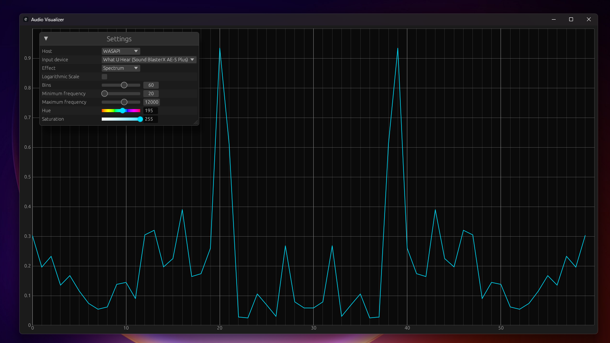
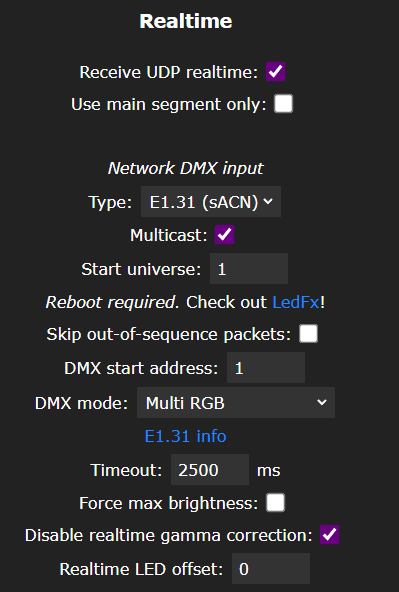

# Audio Visualizer
A program that can visualize music on a LED strip, written in Rust.
This project is a continuation to my previous audio project which was written in Python.

## Demo



See the program in action on [YouTube](https://www.youtube.com/watch?v=M1xNktjkvWU).

## How it's made
The project consists of 2 parts

### The GUI
To give a simple user interface, I wrote a small desktop application with the egui and egui_plot crate.
It provides a preview of the audio effect, which is visualized on the LED strip.
In addition, the program has a small control panel in the top left corner where all audio and effect related settings can be made.

### The Core
This is the heart of the project, where all the audio processing takes place. 
To be able to read audio signals from the computer I used the cpal crate.
Then the raw audio signal goes through several processes, like FFT, Melbank and Exponential-Filter until a visualizable effect comes out.
Finally, the effect is sent to the LED strip (over the sACN protocol) and the user interface.

## Comparison to my python version
As I mentioned at the beginning, this is a continuation of my previous audio visualizer project, which was originally written in Python.
Even though I relied almost exclusively on numpy and co. in Python, the program was unfortunately not as performant as I would have liked it to be. 
To install the visualizer I also needed the python interpreter and all the necessary packages. 
That's why I wanted to build a visualizer that can be used on different devices without much effort and is also very fast. 
Additionally, I also wanted to learn more about the Rust programming language and this seemed like a good starter project for me

If you are more interested in audio processing part, I also recommend you take a look at my Python project, as the concepts there are a bit easier to understand thanks to the Python syntax.

## Usage
- Make sure you habe Stereomix enabled on your computer or any other sound source to visualize your music output.
- Install cargo and rust if you haven't already done so. You can use [rustup](https://www.rust-lang.org/tools/install) for this.
- Clone the repository
- Open a terminal in the project folder and build or run the application

```
# Build an executable file in the target/ directory
cargo build --release
# Or run the programm directly 
cargo run --release
```

### Led stripe
To see the effects in action you need a LED stripe with a small microcontroller attached.
I've used an esp32 microcontroller and a ws2812b/sk8612 strip for this. <br>
You can get yourself a small microcontroller such the ESP32 on which you can run WLED or any other software that allows you to receive the sACN signal from the computer. <br>
For WLED, you must then activate sACN via multicast.




### Recommended but optional:
Use an extra power supply to prevent the power from flowing through the whole esp. Without this, the esp can't deliver the maximum 5V for the leds (Only 3.3V) and could get hot.


## Future
This project was developed primarily for fun, to learn more about audio processing in the Rust programming language. For this reason, no regular updates are planned.
But if this project can help anyone to get a better understanding about audio processing, I would be very grateful.
If your wish to extend this project or build a new one, feel free to create a fork or use my code for your next project.
